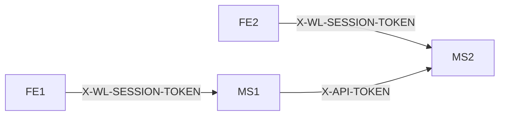

## Communication between applications

Inside the platform there are multiple applications. To make it easier to understand, lets create two groups of them:
* `frontend application`
* `backend application`

These applications can communicate with each other over HTTP protocol. In scope of the participatns he following communications can happen:
* `FE` -- (http) --> `BE`
* `BE` -- (proxy) --> `BE`
* `BE` -- (http) --> `BE`

The difference between `http` and `proxy` is the caller part. It is a `http` communication if the `sdk` is used in the caller side. It is a proxy if the caller uses the `server-sdk` (or `sdk-server`).

For some endpoints authentication is required. These endpoints validating the incoming request.
* if the caller is FE, the `X-WL-SESSION-TOKEN` should be populated with the respective session token
* if the caller is another service (not FE), the `X-API-TOKEN` header should be populated

The `X-API-TOKEN` is a static token, read from the configuration. The caller should know the one of the keys of the called service.

