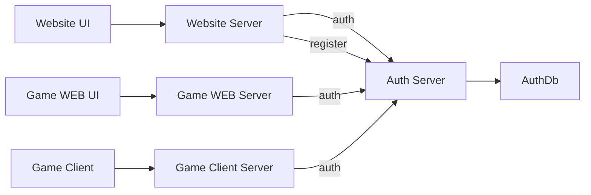

```mermaid
flowchart LR
    webapp[Website UI] --> webnode[Website Server]
    gameweb[Game WEB UI] --> gamenode[Game WEB Server]
    gameclient[Game Client] --> gameclientnode[Game Client Server]
    webnode -- auth --> authnode[Auth Server]
    webnode -- register --> authnode[Auth Server]
    gamenode -- auth --> authnode
    gameclientnode -- auth --> authnode
    authnode --> authdb[AuthDb]
```
