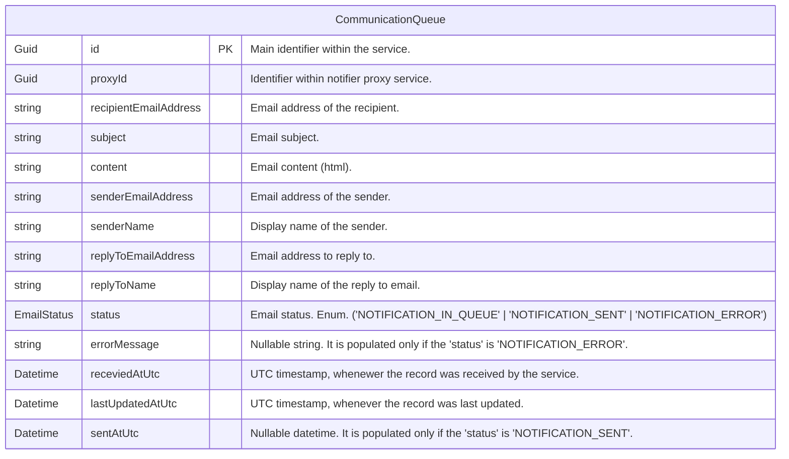

## Email Sender Database

```mermaid

erDiagram
    CommunicationQueue {
        Guid id PK "Main identifier within the service."
        Guid proxyId "Identifier within notifier proxy service."
        string recipientEmailAddress "Email address of the recipient."
        string subject "Email subject."
        string content "Email content (html)."
        string senderEmailAddress "Email address of the sender."
        string senderName "Display name of the sender."
        string replyToEmailAddress "Email address to reply to."
        string replyToName "Display name of the reply to email."
        EmailStatus status "Email status. Enum. ('NOTIFICATION_IN_QUEUE' | 'NOTIFICATION_SENT' | 'NOTIFICATION_ERROR')"
        string errorMessage "Nullable string. It is populated only if the 'status' is 'NOTIFICATION_ERROR'."
        Datetime receviedAtUtc "UTC timestamp, whenewer the record was received by the service."
        Datetime lastUpdatedAtUtc "UTC timestamp, whenever the record was last updated."
        Datetime sentAtUtc "Nullable datetime. It is populated only if the 'status' is 'NOTIFICATION_SENT'."
    }

```
