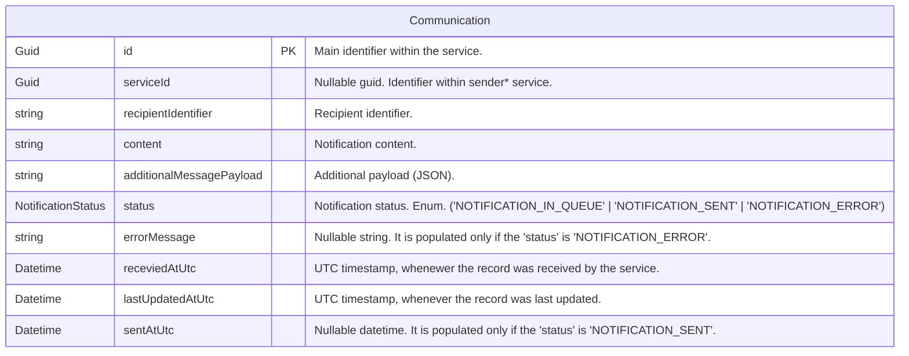

## Notifier Proxy Database

```mermaid

erDiagram
    Communication {
        Guid id PK "Main identifier within the service."
        Guid serviceId "Nullable guid. Identifier within sender* service."
        string recipientIdentifier "Recipient identifier."
        string content "Notification content."
        string additionalMessagePayload "Additional payload (JSON)."
        NotificationStatus status "Notification status. Enum. ('NOTIFICATION_IN_QUEUE' | 'NOTIFICATION_SENT' | 'NOTIFICATION_ERROR')"
        string errorMessage "Nullable string. It is populated only if the 'status' is 'NOTIFICATION_ERROR'."
        Datetime receviedAtUtc "UTC timestamp, whenewer the record was received by the service."
        Datetime lastUpdatedAtUtc "UTC timestamp, whenever the record was last updated."
        Datetime sentAtUtc "Nullable datetime. It is populated only if the 'status' is 'NOTIFICATION_SENT'."
    }

```
