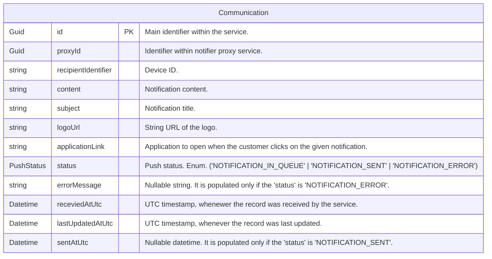

## Push Sender Database

```mermaid

erDiagram
    Communication {
        Guid id PK "Main identifier within the service."
        Guid proxyId "Identifier within notifier proxy service."
        string recipientIdentifier "Device ID."
        string content "Notification content."
        string subject "Notification title."
        string logoUrl "String URL of the logo."
        string applicationLink "Application to open when the customer clicks on the given notification."
        PushStatus status "Push status. Enum. ('NOTIFICATION_IN_QUEUE' | 'NOTIFICATION_SENT' | 'NOTIFICATION_ERROR')"
        string errorMessage "Nullable string. It is populated only if the 'status' is 'NOTIFICATION_ERROR'."
        Datetime receviedAtUtc "UTC timestamp, whenewer the record was received by the service."
        Datetime lastUpdatedAtUtc "UTC timestamp, whenever the record was last updated."
        Datetime sentAtUtc "Nullable datetime. It is populated only if the 'status' is 'NOTIFICATION_SENT'."
    }

```
