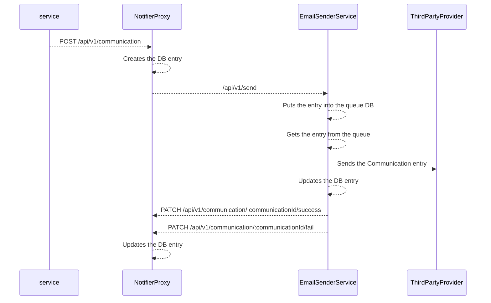

## Email Sender Service

### Summary
This flow is being used when a user forgots their password, and tries to reset it using a front facing microservice.

### Flowchart




### Microservices
* NotifierProxy
* EmailSenderService

### Endpoints

#### NotifierProxy
* `POST` `/api/v1/send`

---

##### `/api/v1/send` (POST)
This is the main entry point the send a communication via the given tunnel. Once its being called, it puts the entry into its database, then updates its in-memory queue with the ID of the newest entry.
The queue processes the items in it by fetching them from the database and sending the communications via a 3rd party provider. Once the communication has been sent, the servie updates the database again and calls the `NotifierProxy` to update the entry there as well.

**Response codes**:
* 202 - Accepted.
* 400 - Bad request.
* 401 - Unauthorized
* 500 - Internal server error.

**Response error codes**
* `E_BAD_REQUEST`
* `E_UNAUTHORIZED_APITOKEN`
* `E_INTERNAL`

**Request headers**
* `X-WL-API-TOKEN`

**Request query parameters**
* `N/A`

**Request path parameters**
* `N/A`

**DTOs**

```ts

export interface EmailSenderPostRequest {
  proxyId: Guid;
  identifier: string;
  content: string;
  additionalMessagePayload: EmailPayload;
}

interface EmailPayload {
  subject: string;
  senderName: string;
  senderEmailAddress: string;
  replyToEmailAddress: string;
  replyToName: string;
}

export interface EmailSenderPostResponse {
  id: string;
}

```

---

### Database tables
This section list the database tables that should be modified to implement this flow end-to-end.

#### EmailSenderService
* `CommunicationQueue`
