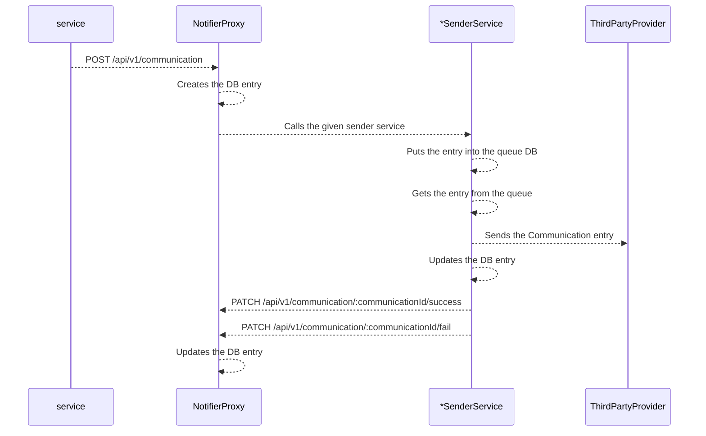

## Notifier Proxy

### Summary
This flow is being used when a user forgots their password, and tries to reset it using a front facing microservice.

### Flowchart




### Microservices
* NotifierProxy
* EmailSenderService
* SmsSenderService
* PushSenderService

### Endpoints

#### NotifierProxy
* `POST` `/api/v1/communication`
* `GET` `/api/v1/communication?skip={number}&take={number}`
* `GET` `/api/v1/communication/:communicationId`
* `PATCH` `/api/v1/communication/:communicationId/success`
* `PATCH` `/api/v1/communication/:communicationId/fail`

---

##### `/api/v1/communication` (POST)
This endpoint is the main entry point of the communications. Once this is being called based on the payload, the subsystem will send the message through the appropiate tunnel to the client. Both the incoming request (payload) and the communcation result (from the respective microsevice) is being logged with their correlation ID.

**Response codes**:
* 202 - The operation succeeded.
* 400 - Bad request.
* 401 - The given proxy microservice has no valid api token.
* 500 - Internal server error.

**Response error codes**
* `E_BAD_REQUEST`
* `E_UNATUHORIZED_APITOKEN`
* `E_INTERNAL`

**Request headers**
* `X-WL-API-TOKEN`

**Request query parameters**
* `N/A`

**Request path parameters**
* `N/A`

**DTOs**

```ts

export interface NotifierProxyCommunicationPostRequest {
  identifier: string;
  content: string;
  tunnel: "NOTIFICATION_EMAIL" | "NOTIFICATION_SMS" | "NOTIFICATION_PUSH";
  additionalMessagePayload: EmailPayload | SmsPayload | PushPayload;
}

interface EmailPayload {
  subject: string;
  senderName: string;
  senderEmailAddress: string;
  replyToEmailAddress: string;
  replyToName: string;
}

interface SmsPayload {
  applicationLink: string;
}

interface PushPayload {
  subject: string;
  logoUrl: string;
}

export interface NotifierProxyCommunicationPostResponse {
  communicationId: string;
}

```

---

##### `/api/v1/communication?skip={number}&take={number}` (GET)
This endpoint returns the latest `n` communications according to the query parameters. This endpoint is mainly used to check if the service works properly.

**Response codes**
* 200 - The operation succeeded.
* 400 - Bad request.
* 401 - The given proxy microservice has no valid api token.
* 500 - Internal server error.

**Response error codes**
* `E_BAD_REQUEST`
* `E_UNATUHORIZED_APITOKEN`
* `E_INTERNAL`

**Request headers**
* `X-WL-API-TOKEN`

**Request query parameters**
* `skip`
* `take`

**Request path parameters**
* `N/A`

**DTOs**

```ts

export interface NotifierProxyCommunicationsGetResponse {
  id: Guid;
  senderServiceId: Guid;
  identifier: string;
  content: string;
  tunnel: "NOTIFICATION_EMAIL" | "NOTIFICATION_SMS" | "NOTIFICATION_PUSH";
  receivedAtUtc: string;
  status: "NOTIFICATION_IN_QUEUE" | "NOTIFICATION_SENT" | "NOTIFICATION_ERROR";
}

```

---

#### `/api/v1/communication/:communicationId` (GET)
This endpoint returns the given communication (specified by its ID). This endpoint is mainly used to check if the service works properly.

**Response codes**
* 200 - The operation succeeded.
* 400 - Bad request.
* 401 - The given proxy microservice has no valid api token.
* 404 - The given communication was not found.
* 500 - Internal server error.

**Response error codes**
* `E_BAD_REQUEST`
* `E_UNATUHORIZED_APITOKEN`
* `E_NOTFOUND_COMMUNICATION`
* `E_INTERNAL`

**Request headers**
* `X-WL-API-TOKEN`

**Request query parameters**
* `N/A`

**Request path parameters**
* `communicationId`

**DTOs**

```ts

export interface NotifierProxyCommunicationGetResponse {
  id: Guid;
  senderServiceId: Guid;
  identifier: string;
  content: string;
  tunnel: "NOTIFICATION_EMAIL" | "NOTIFICATION_SMS" | "NOTIFICATION_PUSH";
  receivedAtUtc: string;
  status: "NOTIFICATION_IN_QUEUE" | "NOTIFICATION_SENT" | "NOTIFICATION_ERROR";
  payload: EmailPayload | SmsPayload | PushPayload;
  // Present if the status is `NOTIFICATION_ERROR`
  errorCode?: string;
  // Present if the status is `NOTIFICATION_SENT`
  sentAtUtc?: string;
}

interface EmailPayload {
  subject: string;
  senderName: string;
  senderEmailAddress: string;
  replyToEmailAddress: string;
  replyToName: string;
}

interface SmsPayload {
  applicationLink: string;
}

interface PushPayload {
  subject: string;
  logoUrl: string;
}

```

---

#### `/api/v1/communication/:communicationId/success` (PATCH)
This endpoint is used to update the specific communication entry. This endpoint is being called by the internal microservices only.

**Response codes**
* 200 - The operation succeeded.
* 400 - Bad request.
* 401 - Unauthorized.
* 404 - Communication was not found
* 500 - Internal server error.

**Response error codes**
* `E_BADREQUEST`
* `E_TOKEN_INVALID`
* `E_COMMUNCATION_NOT_FOUND`
* `E_INTERNAL`

**Request headers**
* `X-WL-API-TOKEN`

**Request query parameters**
* `N/A`

**Request path parameters**
* `communicationId`

**DTOs**

```ts

export interface NotifierProxyCommunicationPatchSuccessRequest {
  sentAtUtc: string;
}

export interface NotifierProxyCommunicationPatchSuccessResponse { }

```

---

#### `/api/v1/communication/:communicationId/fail` (PATCH)
This endpoint is used to update the specific communication entry. This endpoint is being called by the internal microservices only.

**Response codes**
* 200 - The operation succeeded.
* 400 - Bad request.
* 401 - Unauthorized.
* 404 - Communication was not found
* 500 - Internal server error.

**Response error codes**
* `E_BADREQUEST`
* `E_TOKEN_INVALID`
* `E_COMMUNCATION_NOT_FOUND`
* `E_INTERNAL`

**Request headers**
* `X-WL-API-TOKEN`

**Request query parameters**
* `N/A`

**Request path parameters**
* `communicationId`

**DTOs**

```ts

export interface NotifierProxyCommunicationPatchFailedRequest {
  errorMessage: string;
}

export interface NotifierProxyCommunicationPatchFailedResponse { }

```

---

### Database tables
This section list the database tables that should be modified to implement this flow end-to-end.

#### NotifierProxy
* `Communication`

#### EmailSenderService
* `CommunicationQueue`

#### SmsSenderService
* `CommunicationQueue`

#### PushSenderService
* `CommunicationQueue`
