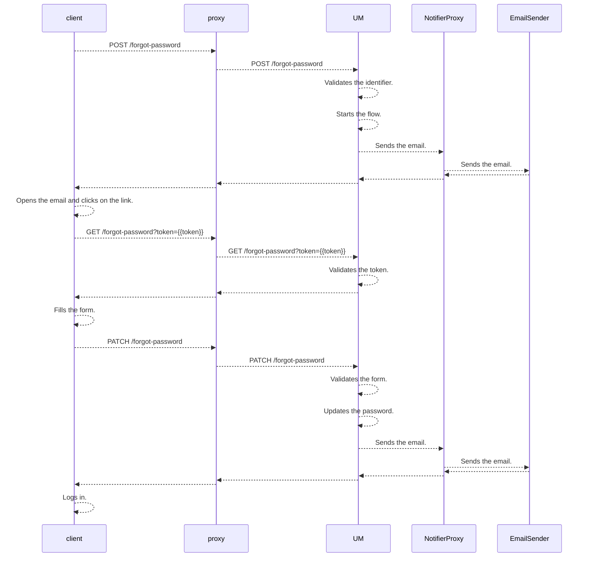

## External Password reset flow

### Summary
This flow is being used when a user forgots their password, and tries to reset it using a front facing microservice.

### Flowchart


### Microservices
* UserManagement
* NotifierProxy
* EmailSender
* any front facing microservice

### Endpoints

#### User management
* `POST` `/external/api/v1/user/forgot-password`
* `GET` `/external/api/v1/user/forgot-password`
* `PATCH` `/external/api/v1/user/forgot-password`

#### User management server SDK
* `POST` `/api/v1/user/forgot-password`
* `GET` `/api/v1/user/forgot-password`
* `PATCH` `/api/v1/user/forgot-password`

---

##### `/external/api/v1/user/forgot-password` (POST)
This endpoint starts the forgot password flow. It checks if the given identifier is valid (the email or the username is found in the database, and the user status is ACTIVE). If the incoming request is valid, then it generates a token for password verification that lives for 24 hours. Sends the token via email to the user's email address.

**Response codes**:
* 200 - The flow has started successfully.
* 400 - Bad request.
* 401 - The given proxy microservice has no valid api token.
* 404 - User with the given identifier was not found.
* 500 - Internal server error.

**Response error codes**
* `E_BAD_REQUEST`
* `E_UNATUHORIZED_APITOKEN`
* `E_NOTFOUND_USER`
* `E_INTERNAL`

**Request headers**
* `X-WL-API-TOKEN`

**Request query parameters**
* `N/A`

**Request path parameters**
* `N/A`

**DTOs**
```ts

export interface ExternalUserForgotPasswordPostRequest {
  identifier: string;
}

```


```ts

export interface ExternalUserForgotPasswordPostResponse {
}

```

---

##### `/external/api/v1/user/forgot-password` (GET)
This endpoint validates if the given token is a valid password reset token by checking it the respective tables (user and usertoken).

**Response codes**:
* 202 - The token is accepted.
* 400 - Bad request.
* 401 - The given proxy microservice has no valid api token.
* 404 - User with the given identifier was not found.
* 410 - The verification token is not alive anymore.
* 412 - The verification token is already used.
* 500 - Internal server error.

**Response error codes**
* `E_BAD_REQUEST`
* `E_UNATUHORIZED_APITOKEN`
* `E_NOTFOUND_USER`
* `E_TOKEN_OUTDATED`
* `E_TOKEN_ALREADYUSED`
* `E_INTERNAL`

**Request headers**
* `X-WL-API-TOKEN`

**Request query parameters**
* `token`

**Request path parameters**
* `N/A`

**DTOs**

```ts

export interface ExternalUserForgotPasswordGetResponse {
}

```
---

##### `/external/api/v1/user/forgot-password` (PATCH)
This endpoint closes the password reset flow. It validates if the given token is a valid password reset token by checking it the respective tables (user and usertoken). If it is, then it validates the incoming password and its verification, then updates the user's password. This endpoints marks the given reset token as used as well.

**Response codes**:
* 202 - The token is accepted.
* 400 - Bad request.
* 401 - The given proxy microservice has no valid api token.
* 404 - User with the given identifier was not found.
* 410 - The verification token is not alive anymore.
* 412 - The verification token is already used.
* 500 - Internal server error.

**Response error codes**
* `E_BAD_REQUEST`
* `E_BAD_REQUST_PASSWORD`
* `E_UNATUHORIZED_APITOKEN`
* `E_NOTFOUND_USER`
* `E_TOKEN_OUTDATED`
* `E_TOKEN_ALREADYUSED`
* `E_INTERNAL`

**Request headers**
* `X-WL-API-TOKEN`

**Request query parameters**
* `token`

**Request path parameters**
* `N/A`

**DTOs**

```ts

export interface ExternalUserForgotPasswordPatchRequest {
  password: string;
  passwordVerification: string;
}

export interface ExternalUserForgotPasswordPatchResponse {
}

```

---

##### `/api/v1/user/forgot-password` (POST)
This endpoint is part of the server SDK. Once added to the given server it proxies the request to the user management microservice.

**Response codes**:
* 200 - The flow has started successfully.
* 400 - Bad request.
* 401 - The given proxy microservice has no valid api token.
* 404 - User with the given identifier was not found.
* 500 - Internal server error.

**Response error codes**
* `E_BAD_REQUEST`
* `E_UNATUHORIZED_APITOKEN`
* `E_NOTFOUND_USER`
* `E_INTERNAL`

**Request headers**
* `X-WL-API-TOKEN`

**Request query parameters**
* `N/A`

**Request path parameters**
* `N/A`

**DTOs**
```ts

export interface ExternalUserForgotPasswordProxyPostRequest {
  identifier: string;
}

```


```ts

export interface ExternalUserForgotPasswordProxyPostResponse {
}

```

---

##### `/api/v1/user/forgot-password` (GET)
This endpoint is part of the server SDK. Once added to the given server it proxies the request to the user management microservice.

**Response codes**:
* 202 - The token is accepted.
* 400 - Bad request.
* 401 - The given proxy microservice has no valid api token.
* 404 - User with the given identifier was not found.
* 410 - The verification token is not alive anymore.
* 412 - The verification token is already used.
* 500 - Internal server error.

**Response error codes**
* `E_BAD_REQUEST`
* `E_UNATUHORIZED_APITOKEN`
* `E_NOTFOUND_USER`
* `E_TOKEN_OUTDATED`
* `E_TOKEN_ALREADYUSED`
* `E_INTERNAL`

**Request headers**
* `X-WL-API-TOKEN`

**Request query parameters**
* `token`

**Request path parameters**
* `N/A`

**DTOs**

```ts

export interface ExternalUserForgotPasswordGetResponse {
}

```

---

##### `/api/v1/user/forgot-password` (PATCH)
This endpoint is part of the server SDK. Once added to the given server it proxies the request to the user management microservice.

**Response codes**:
* 202 - The token is accepted.
* 400 - Bad request.
* 401 - The given proxy microservice has no valid api token.
* 404 - User with the given identifier was not found.
* 410 - The verification token is not alive anymore.
* 412 - The verification token is already used.
* 500 - Internal server error.

**Response error codes**
* `E_BAD_REQUEST`
* `E_BAD_REQUST_PASSWORD`
* `E_UNATUHORIZED_APITOKEN`
* `E_NOTFOUND_USER`
* `E_TOKEN_OUTDATED`
* `E_TOKEN_ALREADYUSED`
* `E_INTERNAL`

**Request headers**
* `X-WL-API-TOKEN`

**Request query parameters**
* `token`

**Request path parameters**
* `N/A`

**DTOs**

```ts

export interface ExternalUserForgotPasswordPatchRequest {
  password: string;
  passwordVerification: string;
}

export interface ExternalUserForgotPasswordPatchResponse {
}

```

---

### Database tables
This section list the database tables that should be modified to implement this flow end-to-end.

#### User Management
* `User`
* `UserToken`
* `UserCommunication`

##### Notifier Proxy
* `Communication`

##### Email Sender
* `Email`
