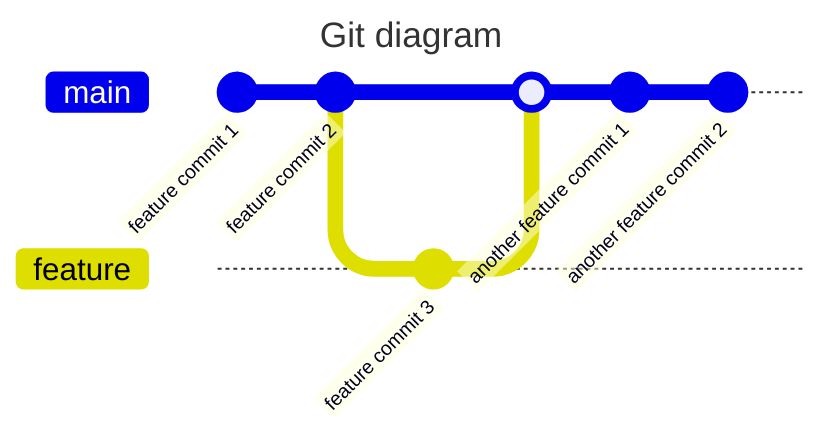

## How to reset your branch to its origin version

In some cases you may commited some changes to the wrong branch, for example you've added a commit to `main` before creating a new branch.
In such cases the easiest scenario is to create a branch from `main`, push it, then reset main to its origin state.




As you can see on the diagram above `feature commit 1` and `feature commit 2` was added to `main`, but `feature commit 3` was added to the feature branch and its parent is `feature commit 2`. After the deltas are pushed, or the branch has been created locally, you may need to reset `main` to `origin/main`, so your local `main` wont have any pollution commits in it.

To do that, you have to run the following command once the branch is checked out:

```sh

git checkout {{branchName}}
git reset --hard origin/{{branchName}}

```
